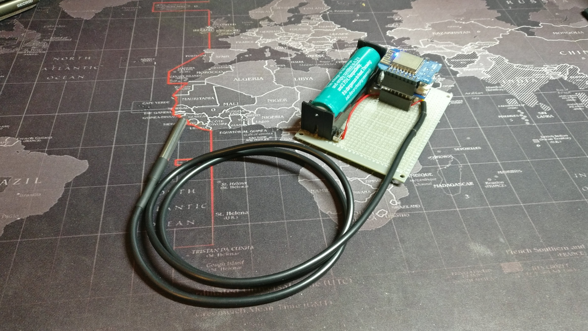

# microBrew-controller
> Homebrew done the smart way

Brewing beer at home is a really cool hobby. Sometimes, it can be a bit tedious, but nothing can compete with the taste of the beer that you brewed yourself.

To help myself with this task, I'm building a **microBrew** suite that will help me to automate some of the tasks, and hopefully make the whole process a bit easier.

This project contains the source code and the circuit diagram for the controller that works in tandem with `microBrew-server`, controlling heating element to maintain optimal temperature of the brew.

## Hardware
Currently, controller uses a WeMos D1 Mini (ESP8266) board and DS18B20 waterproof temperature sensors used for recording ambient and the brew temperatures. On top of that, it also controls two relays used for controlling of heating element and a cooler.



## Configuration

Configuration is pretty straight forward. You just need to provide wifi credentials and microBrew-server hostname and port on top of the `app.ino` file.

```c++
// Populate wifi credentials
const char *ssid = "$$$$";
const char *psk = "$$$$";

// Populate server details
const char *host = "$$$$";
const uint16_t port = 52100;

```
